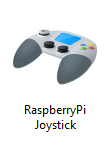
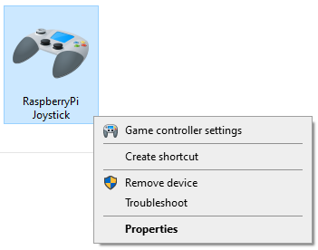
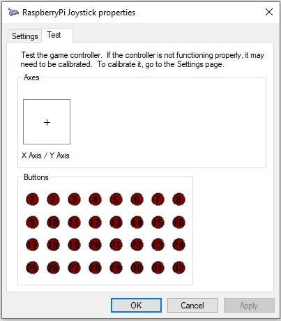

# RaspberryPi Zero W as a Virtual joystick
This project was developed to turn a RaspberryPi Zero into a virtual joystick

1. Download the GPIO Python package:
   ```
   sudo apt-get update
   sudo apt-get -y install rpi.gpio python3-gpiozero
   ```

1. Copy the USB device creation script to /usr/bin and make it executable
   ```
   sudo cp device.sh /usr/bin
   sudo chmod +x /usr/bin/device.sh
   ```
1. The RaspberryPi uses dynamic device creation so the creation script needs to be run every time the Pi boots. To configure the Zero to run the USB joystick device creation on boot add the following line above 'exit 0' to the file ```/etc/rc.local```
   ```
   /usr/bin/joystick.sh
   ```
1. Reboot the Zero
   ```
   sudo reboot
   ```
1. Connect the Zero to your computer, you should now see the virtual joystick in your devices
   - Control Panel -> Devices and Printers
   
   

# Testing the virtual joystick
1. Right click the joystick and select
   
   - Game controller settings
   - Properties button
   - Test tab
   
   
1. On the Zero run the command:
   ```
   sudo python3 js_single_button.py
   ```
1. On the GPIO pins of the Zero connect the following pins to pin 6 (third from the top on the right) and this is the result you should see:
   1. Pin 3 (second left) - Button 1
   1. Pin 5 (third left)  - Button 10
   1. Pin 7 (fourth left) - Button 18
   1. Pin 40 (last right) - Button 26
1. To exit the script use Ctrl+C
1. Copy and paste the top 30+ lines of the test script to your own project
1. Configure the GPIO pins to trigger whichever joystick button you need

If you want to know all I have learned while creating this project so you can customise or change the configuration then read the 'About HID joysticks' file